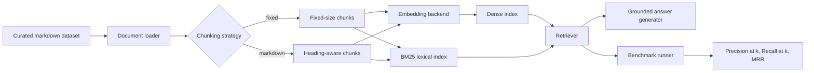

# Architecture Overview

## Problem interpretation

The brief asks for a RAG system that can ingest documents, chunk them, embed them, retrieve relevant context, answer with grounding, and benchmark retrieval quality. The mandatory comparative requirement is satisfied by testing **two chunking strategies**.

## System diagram

## Components

### Document loader
- Reads markdown files from [data/raw](data/raw)
- Extracts metadata from lightweight front matter

### Chunkers
- `fixed`: overlapping word windows
- `markdown`: heading-aware sections with fallback splitting for long sections

### Embedding layer
- Preferred backend: `sentence-transformers`
- Fallback backend: TF-IDF for smoke testing when no embedding model is available

### Retrieval
- Dense retrieval uses cosine similarity over chunk vectors
- Optional hybrid mode fuses dense rank and BM25 rank using reciprocal-rank fusion
- Optional reranking uses a cross-encoder over the retrieved candidate set before answer generation

### Grounded generation
- Default: extractive sentence selection from top retrieved chunks
- Optional: OpenAI-based synthesis when credentials are present

### Evaluation
- Uses 10 curated test questions
- Tracks:
  - `precision@k`
  - `recall@k`
  - `mrr`
  - answer grounding hit rate

## Key design choices

| Choice | Why |
|---|---|
| Small local markdown dataset | Keeps the prototype deterministic and demo-friendly |
| Two chunking strategies | Satisfies the mandatory comparative testing requirement |
| Dense + optional hybrid retrieval | Delivers a required baseline and a bonus extension |
| Optional reranking | Improves final ranking quality without changing the first-stage retriever |
| Local answer fallback | Ensures the demo works even without API keys |
| Document-level relevance labels | Keeps evaluation transparent and reproducible |

## Technology choices and reasoning

| What we chose | Why we chose it | What we considered | Trade-offs |
|---|---|---|---|
| Python CLI workflow | Fast iteration and reproducible local execution for a 2-day window | Full web app UI | CLI is less visual, but maximizes depth over polish |
| `sentence-transformers/all-MiniLM-L6-v2` for dense embeddings | Strong semantic retrieval quality with local inference | TF-IDF only baseline | Better semantics but requires model download and more runtime |
| BM25 (`rank-bm25`) for lexical retrieval | Captures exact tokens/acronyms that dense retrieval can miss | Dense-only retrieval | Extra index + fusion complexity |
| Hybrid rank fusion (RRF-style) | Robustly combines dense and lexical ranks with minimal tuning | Weighted raw-score blending | Rank fusion is simpler but less expressive than calibrated score fusion |
| Cross-encoder reranking (`ms-marco-MiniLM-L-6-v2`) | Improves final ordering over top candidates | No reranking, heuristic reranking | Quality lift with added latency |
| Extractive local fallback answerer | Keeps answers grounded and demo-ready without API keys | LLM-only answer generation | More factual control but less fluent output |
| Optional OpenAI synthesis path | Provides fluent answering when API credentials are available | Anthropic/local chat models in this prototype | API dependency and external cost |

## Trade-offs

- The dataset is intentionally compact, so absolute retrieval scores may be optimistic.
- The default local answerer is grounded but less fluent than an LLM.
- Dense retrieval quality depends on the chosen embedding backend.

## Improvements with more time

1. Add reranking with a cross-encoder.
2. Expand the dataset with more domain-specific documents.
3. Add latency and cost benchmarking.
4. Build a lightweight Streamlit demo.
5. Add answer faithfulness and citation coverage metrics.
